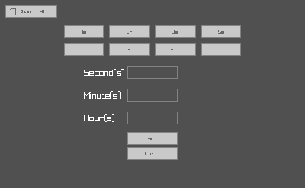

# Glock
**Gui Clock** (a timer really) written in c using [raylib](https://github.com/raysan5/raylib) and [raygui](https://github.com/raysan5/raygui)

<p align="center">
  
</p>

## Compile
You need to install raylib first
after installing raylib go to the project root and run
```
make
```
an executable named `glock` should be made inside the `target` directory which will also be created at the root of the project.
